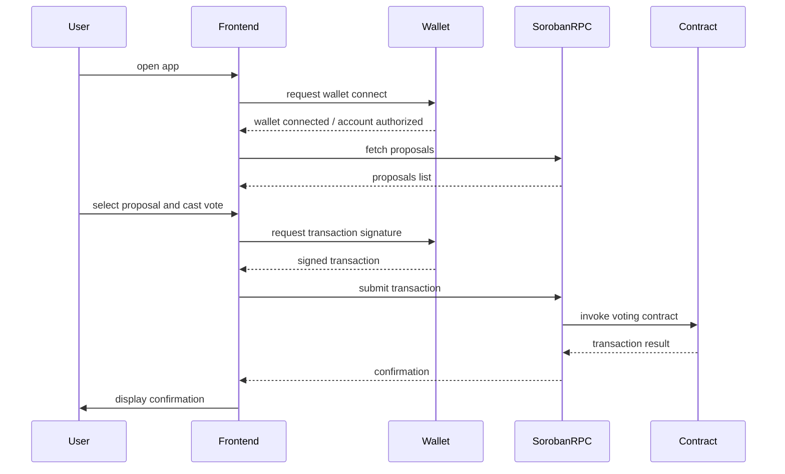

# CosmosVote Contracts

[](https://github.com/mercyJJ/cosmosvote/actions/workflows/ci.yml)
[](https://github.com/mercyJJ/cosmosvote/actions/workflows/codeql.yml)
[](./LICENSE)
[](./CONTRIBUTING.md)

Soroban smart contracts for **CosmosVote** — decentralized on-chain governance and voting on the Stellar blockchain.

CosmosVote enables DAOs, protocols, and communities to create proposals, cast token-weighted votes, enforce quorum, and execute decisions — all transparently on-chain with an immutable audit trail.

---

## Table of Contents

- [Project Overview](#project-overview)
- [Architecture.](#architecture)
- [Features](#features)
- [Quick Start](#quick-start)
- [Project Structure](#project-structure)
- [Governance Contract Reference](#governance-contract-reference)
- [Token Contract Reference](#token-contract-reference)
- [Proposal Lifecycle](#proposal-lifecycle)
- [Storage & Data Structures](#storage--data-structures)
- [Configuration](#configuration)
- [Development](#development)
- [Testing](#testing)
- [Security](#security)
- [Contributing](#contributing)
- [Resources](#resources)

---

## Project Overview

### Motivation

Decentralized governance is critical for DAOs, protocols, and communities to make collective decisions transparently and fairly. CosmosVote provides a production-ready governance system on Stellar's Soroban platform with:

- **Token-weighted voting** — voting power proportional to economic stake
- **Quorum enforcement** — minimum participation thresholds
- **Immutable audit trail** — all votes and decisions recorded on-chain
- **Flexible proposal lifecycle** — from creation through execution or cancellation
- **Cost-efficient storage** — optimized for Soroban's tiered storage model

---

## Architecture

```
┌─────────────────────────────────────────────────────────────┐
│                    CosmosVote System                         │
├─────────────────────────────────────────────────────────────┤
│                                                              │
│  ┌──────────────────────┐      ┌──────────────────────┐    │
│  │  Governance Contract │      │   Token Contract     │    │
│  ├──────────────────────┤      ├──────────────────────┤    │
│  │ • Proposals          │      │ • Balances           │    │
│  │ • Voting             │◄─────┤ • Transfers          │    │
│  │ • Finalization       │      │ • Mint/Burn          │    │
│  │ • Execution          │      │ • Allowances         │    │
│  │ • Cancellation       │      │ • Admin Control      │    │
│  └──────────────────────┘      └──────────────────────┘    │
│           │                              │                   │
│           └──────────────┬───────────────┘                  │
│                          │                                   │
│                    ┌─────▼──────┐                           │
│                    │  Soroban   │                           │
│                    │ Blockchain │                           │
│                    │ (Stellar)  │                           │
│                    └────────────┘                           │
└─────────────────────────────────────────────────────────────┘
```
### Frontend ↔ Contract Interaction

The user flow between the frontend, wallet, Soroban RPC, and smart contracts is documented below. This flow is also available as a dedicated Mermaid diagram in [docs/frontend-contract-flow.md](docs/frontend-contract-flow.md).


### Key Design Decisions

| Decision | Approach |
|----------|----------|
| Voting model | Token-weighted — vote weight = balance at vote time |
| Vote types | Yes / No / Abstain (abstain counts toward quorum, not outcome) |
| Double-vote prevention | Persistent `HasVoted` flag per (proposal, voter) |
| Storage tiers | Instance for config, Persistent for proposals/votes, Temporary for allowances |
| Events | Every state transition emits an on-chain event |
| Tie handling | Tie (yes == no) results in rejection |
| Admin vote restriction | When `restrict_admin_vote=true`, admin cannot vote on **any** proposal |

---

## Features

- **Proposals** — create governance proposals with title, description, quorum, and voting duration
- **Token-weighted voting** — vote weight equals the voter's governance token balance
- **Yes / No / Abstain** — three-way vote with quorum and majority enforcement
- **Double-vote prevention** — each address can vote exactly once per proposal
- **Vote delegation** — token holders can delegate voting power to a representative without transferring tokens
- **Lifecycle management** — Active → Passed/Rejected → Executed, or Cancelled by admin
- **On-chain events** — every action emits a verifiable event for off-chain indexers
- **Admin controls** — pause/unpause, update quorum, transfer admin privileges
- **Proposal cooldown** — optional rate limiting per proposer
- **Minimum balance requirement** — optional minimum tokens to create proposals

---

## Quick Start

### Prerequisites

- Rust 1.75+ with `wasm32-unknown-unknown` target.
- Stellar CLI (optional, for deployment)
- Docker & Docker Compose (optional).

### Supported Versions

| Component | Supported versions | Notes |
|-----------|-------------------|-------|
| Rust | 1.75 (MSRV), stable, beta | Tested via CI matrix |
| Node.js | 20 (LTS), 22 (current LTS) | For frontend build |

Matrix build status is tracked in the [Matrix Tests workflow](.github/workflows/matrix.yml).

### 1. Clone & Configure

```bash
git clone https://github.com/mercyJJ/cosmosvote.git
cd cosmosvote

# Copy and edit root config
cp .env.example .env
# Set NETWORK, STELLAR_SECRET_KEY, GOVERNANCE_CONTRACT_ID, TOKEN_CONTRACT_ID
```

### 2. Contracts

```bash
# Add WASM compilation target
rustup target add wasm32-unknown-unknown

# Run all tests
make test

# Build WASM binaries
make build

# (Optional) View generated docs
cargo doc --no-deps --open
```

### 3. Frontend

```bash
cd frontend

# Install dependencies
npm install

# Copy and edit frontend config
cp .env.example .env
# Set VITE_GOVERNANCE_CONTRACT_ID, VITE_TOKEN_CONTRACT_ID, VITE_NETWORK

# Start development server (http://localhost:5173)
npm run dev

# Build for production
npm run build
npm run preview
```

### 4. Notification Service

> **Note:** A dedicated notification service is planned. In the meantime, operators can receive on-chain event notifications via webhooks using the Stellar Horizon event stream.

```bash
# Subscribe to contract events via Stellar CLI
stellar events --network testnet \
  --contract-id $GOVERNANCE_CONTRACT_ID \
  --start-ledger <DEPLOY_LEDGER>
```

For automated alerts, configure a webhook listener against the Horizon `/accounts/{id}/payments` or Soroban event endpoint and forward events to Slack, Discord, or email.

### 5. Local Development with Docker

```bash
# Start all services (local Stellar node + dev container)
docker compose up

# Run tests inside the container
docker compose run --rm dev make test

# Build inside the container
docker compose run --rm dev make build
```

---

## Project Structure

```
cosmosvote/
├── contracts/
│   ├── governance/                    # Governance contract
│   │   ├── src/
│   │   │   ├── lib.rs                # Main contract implementation
│   │   │   ├── storage.rs            # Storage accessors & tier strategy
│   │   │   ├── events.rs             # Event emission
│   │   │   ├── types.rs              # Error types & data structures
│   │   │   ├── test.rs               # Unit tests (40+ tests)
│   │   │   ├── test_helpers.rs       # Test utilities
│   │   │   └── prop_tests.rs         # Property-based tests
│   │   └── Cargo.toml
│   │
│   └── token/                        # Token contract
│       ├── src/
│       │   ├── lib.rs                # Token implementation
│       │   ├── storage.rs            # Storage accessors
│       │   ├── events.rs             # Event emission
│       │   ├── types.rs              # Error types & data structures
│       │   └── test.rs               # Unit tests (20+ tests)
│       └── Cargo.toml
│
├── docs/
│   ├── adr/                          # Architecture Decision Records
│   ├── security/                     # Security documentation
│   ├── examples/                     # Integration examples
│   ├── GETTING_STARTED.md
│   ├── lifecycle.md
│   ├── storage.md
│   ├── errors.md
│   ├── faq.md
│   └── runbook.md
│
├── scripts/
│   ├── deploy.sh                     # Deploy to local/testnet
│   ├── deploy_mainnet.sh             # Deploy to mainnet
│   └── test_wasm.sh                  # Test WASM builds
│
├── config/
│   ├── local.toml
│   ├── testnet.toml
│   └── mainnet.toml
│
├── notification-service/             # Off-chain notification service
│   ├── src/
│   │   ├── index.ts                  # CLI entry point
│   │   ├── watcher.ts                # Horizon event poller
│   │   ├── notifier.ts               # Email & webhook dispatch
│   │   ├── subscriptions.ts          # Subscription management
│   │   └── types.ts                  # Shared types
│   ├── .env.example
│   ├── package.json
│   └── tsconfig.json
│
├── frontend/                         # React + Vite proposal browser
├── Cargo.toml                        # Workspace manifest
├── Makefile
├── Dockerfile
├── docker-compose.yml
├── .env.example
├── CONTRIBUTING.md
├── SECURITY.md
├── AUDIT.md
├── CHANGELOG.md
└── README.md
```

---

## Governance Contract Reference

### Initialization

```rust
pub fn initialize(
    env: Env,
    admin: Address,
    voting_token: Address,
    min_proposal_balance: i128,
    proposal_cooldown: u64,
    min_quorum_bps: u32,
    restrict_admin_vote: bool,
) -> Result<(), ContractError>
```

### Create Proposal

```rust
pub fn create_proposal(
    env: Env,
    proposer: Address,
    title: String,        // 1–128 chars
    description: String,  // 1–1024 chars
    quorum: i128,         // > 0, <= total supply
    duration: u64,        // 60–2,592,000 seconds
    payload: Option<ExecutionPayload>, // Optional on-chain action
) -> Result<u64, ContractError>
```

### Cast Vote

```rust
pub fn cast_vote(
    env: Env,
    voter: Address,
    proposal_id: u64,
    vote: Vote,           // Yes | No | Abstain
) -> Result<(), ContractError>
```

### Finalize

```rust
pub fn finalise(env: Env, proposal_id: u64) -> Result<(), ContractError>
```

Pass conditions: `total_votes >= quorum AND votes_yes > votes_no`

The `finalise()` function is permissionless and is intended to be called by an off-chain keeper or bot after the voting period ends. This ensures proposals do not stay stuck in `Active` state even if no single voter submits the finalization transaction.

### Execute / Cancel

```rust
pub fn execute(env: Env, admin: Address, proposal_id: u64) -> Result<(), ContractError>
pub fn cancel(env: Env, admin: Address, proposal_id: u64, reason: Option<String>) -> Result<(), ContractError>
```

### Admin Operations

```rust
// Update the governance token address (only if no active proposals)
pub fn update_voting_token(env: Env, admin: Address, new_token: Address) -> Result<(), ContractError>

// Update quorum for an active proposal
pub fn update_quorum(env: Env, admin: Address, proposal_id: u64, new_quorum: i128) -> Result<(), ContractError>

// Two-step admin transfer
pub fn transfer_admin(env: Env, admin: Address, new_admin: Address) -> Result<(), ContractError>
pub fn accept_admin(env: Env, pending_admin: Address) -> Result<(), ContractError>
```

---

## Token Contract Reference

### SEP-41 Compliance

The CosmosVote token contract implements the **Stellar Enhancement Proposal 41 (SEP-41)** standard for token contracts on Soroban. This ensures wallet and explorer compatibility for token discovery, display, and transfer operations.

### Theoretical Maximum Supply

The token contract stores all balances and the total supply as `i128`. The maximum representable value is `i128::MAX = 170_141_183_460_469_231_731_687_303_715_884_105_727`. Mint operations use `checked_add` to enforce this bound — any mint that would exceed `i128::MAX` returns `ArithmeticOverflow`. In practice, governance vote tallies are bounded by total supply, making arithmetic overflow in `cast_vote` impossible for any valid token supply.

### Initialization

```rust
pub fn initialize(
    env: Env,
    admin: Address,
    initial_supply: i128,
    name: String,
    symbol: String,
    decimals: u32
) -> Result<(), ContractError>
```

**Parameters:**
- `admin` — Receives initial supply and admin privileges
- `initial_supply` — Total tokens minted to admin
- `name` — Human-readable token name (e.g., "CosmosVote")
- `symbol` — Ticker symbol (e.g., "VOTE")
- `decimals` — Number of decimal places (typically 7 for Stellar)

### Core Operations

```rust
pub fn transfer(env: Env, from: Address, to: Address, amount: i128) -> Result<(), ContractError>
pub fn mint(env: Env, admin: Address, to: Address, amount: i128) -> Result<(), ContractError>
pub fn burn(env: Env, admin: Address, from: Address, amount: i128) -> Result<(), ContractError>
pub fn burn_self(env: Env, owner: Address, amount: i128) -> Result<(), ContractError>
pub fn approve(env: Env, owner: Address, spender: Address, amount: i128) -> Result<(), ContractError>
pub fn transfer_from(env: Env, spender: Address, from: Address, to: Address, amount: i128) -> Result<(), ContractError>
```

### SEP-41 Query Functions

```rust
pub fn name(env: Env) -> String              // Token name
pub fn symbol(env: Env) -> String            // Ticker symbol
pub fn decimals(env: Env) -> u32             // Decimal places
pub fn total_supply(env: Env) -> i128        // Total supply
pub fn balance(env: Env, owner: Address) -> i128  // Account balance
```

### Delegation

```rust
pub fn delegate(env: Env, owner: Address, delegate_to: Address) -> Result<(), ContractError>
pub fn undelegate(env: Env, owner: Address) -> Result<(), ContractError>
pub fn get_delegation(env: Env, owner: Address) -> Option<Address>
pub fn get_delegated_weight(env: Env, voter: Address, delegators: Vec<Address>) -> i128
```

See [docs/delegation.md](./docs/delegation.md) for the full delegation model and behavior.

---

## Proposal Lifecycle

```
        ┌──────────────┐
        │    Active    │
        └──────────────┘
               │
    ┌──────────┼──────────┐
    ▼          ▼          ▼
┌────────┐ ┌────────┐ ┌──────────┐
│ Passed │ │Rejected│ │Cancelled │
└────────┘ └────────┘ └──────────┘
    │
    ▼
┌──────────┐
│ Executed │
└──────────┘
```

| Transition | Trigger | Caller | Condition |
|------------|---------|--------|-----------|
| Active → Passed | `finalise()` | Anyone | `total_votes >= quorum AND yes > no` |
| Active → Rejected | `finalise()` | Anyone | quorum not met OR `yes <= no` |
| Active → Cancelled | `cancel()` | Admin | — |
| Passed → Executed | `execute()` | Admin | — |

---

## Storage & Data Structures

### Governance — Instance Storage

| Key | Type | Purpose |
|-----|------|---------|
| `Admin` | `Address` | Admin address |
| `VotingToken` | `Address` | Governance token address |
| `ProposalCount` | `u64` | Monotonic proposal ID counter |
| `ActiveProposalCount` | `u64` | Current number of non-terminal proposals |
| `MinProposalBalance` | `i128` | Minimum balance to propose |
| `ProposalCooldown` | `u64` | Seconds between proposals |
| `RestrictAdminVote` | `bool` | Admin vote restriction flag |
| `Paused` | `bool` | Contract pause state |

### Governance — Persistent Storage

| Key | Type | Purpose |
|-----|------|---------|
| `Proposal(id)` | `Proposal` | Full proposal state |
| `HasVoted(id, voter)` | `bool` | Double-vote guard |
| `VoteRecord(id, voter)` | `VoteRecord` | Vote type + weight |
| `LastProposal(proposer)` | `u64` | Cooldown timestamp |

---

## Configuration

```bash
cp .env.example .env
# Edit .env with your values
```

Key variables: `NETWORK`, `STELLAR_RPC_URL`, `STELLAR_SECRET_KEY`, `GOVERNANCE_CONTRACT_ID`, `TOKEN_CONTRACT_ID`.

### `restrict_admin_vote` flag

The `restrict_admin_vote` parameter passed to `initialize` controls a narrow voting restriction on the admin:

- **`false` (default):** The admin can vote on any proposal, including ones they created.
- **`true`:** The admin is blocked from voting **only on proposals that the admin themselves created**. The admin can still vote freely on proposals created by other addresses.

This is intentionally scoped — it prevents a conflict of interest when the admin is also the proposer, without removing the admin's ability to participate in governance generally.

> **Note:** This behavior is tracked in issue #14, which documents the ambiguity in the original specification. The current implementation blocks admin voting only when `voter == admin && proposal.proposer == admin`.

**Example:**

```rust
// Admin creates a proposal — admin CANNOT vote on it when restrict_admin_vote = true
gov.initialize(&admin, &token_id, &0, &0, &0, &true);
let id = gov.create_proposal(&admin, ...);
gov.cast_vote(&admin, &id, &Vote::Yes); // → Err(AdminVoteRestricted)

// Admin votes on a proposal created by someone else — this is ALLOWED
let id2 = gov.create_proposal(&other_user, ...);
gov.cast_vote(&admin, &id2, &Vote::Yes); // → Ok(())
```

---

## Development

### With Docker

The Dockerfile uses a **multi-stage build** to keep the final image small and free of build tooling:

| Stage | Base image | Purpose |
|-------|-----------|---------|
| `builder` | `rust:1.75-slim-bookworm` (pinned to digest) | Compiles WASM binaries |
| `runtime` | `debian:bookworm-slim` (pinned to digest) | Ships only `*.wasm` artifacts + Stellar CLI |

Both base images are pinned to a specific digest for reproducible builds.

**Build the runtime image** (WASM artifacts only):

```bash
docker build --target runtime -t cosmosvote:latest .
```

**Build only the builder stage** (useful for running tests in CI):

```bash
docker build --target builder -t cosmosvote:builder .
docker run --rm cosmosvote:builder make test
```

**Run the dev environment** via Docker Compose:

```bash
# Start a dev shell (builder stage — full Rust toolchain)
docker compose up
docker compose run --rm dev make test
docker compose run --rm dev make build

# Build the minimal runtime image (WASM artifacts only)
docker compose --profile artifacts build artifacts

# Or build directly with Docker
docker build --target builder -t cosmosvote:builder .   # dev / CI
docker build --target runtime -t cosmosvote:runtime .   # production artifact image
```

### Without Docker

```bash
rustup target add wasm32-unknown-unknown
make test
make build
make lint
```

### Makefile Targets

| Target | Description |
|--------|-------------|
| `make test` | Run all tests |
| `make build` | Build WASM binaries |
| `make lint` | Run Clippy |
| `make fmt` | Format code |
| `make clean` | Remove build artifacts |
| `make ci` | Full CI check |

---

## Testing

```bash
make test                          # All unit and integration tests
make test-verbose                  # Tests with output
cargo test -p cosmosvote-governance  # Governance contract only
cargo test -p cosmosvote-token       # Token contract only
cargo test --test integration_tests  # Integration tests only
cargo test prop_                   # Property-based tests
```

### Integration Tests

End-to-end integration tests verify the full proposal lifecycle with real contract interactions between the governance and token contracts. Tests cover:

- **Full pass lifecycle**: Proposal creation → voting → finalization → execution
- **Full reject lifecycle**: Proposals that fail to meet quorum or vote threshold
- **Cancel lifecycle**: Admin-cancelled proposals
- **Voting power**: Verification that voting power correctly reflects token balances
- **Quorum enforcement**: Proposals are rejected if quorum is not met

Run integration tests with:

```bash
make test-integration
```

---

## Security

See [SECURITY.md](./SECURITY.md) for the vulnerability disclosure policy and [docs/security/](./docs/security/) for the full threat model.

### Pause Mechanism

The contract includes a pause mechanism for emergency response. When the contract is **paused**:
- **Blocked:** `create_proposal`, `cast_vote`, `finalise`.
- **Allowed:** `execute`, `cancel`, `unpause`, `transfer_admin`, `accept_admin`, `update_quorum`.

Key security properties:
- `require_auth()` on all state-changing operations
- Double-vote prevention via persistent `HasVoted` flag
- Arithmetic overflow protection via `checked_add`
- Contract pause mechanism for emergency response
- One-time initialization guard

---

## Contributing

See [CONTRIBUTING.md](./CONTRIBUTING.md). Quick checklist:

1. Fork → feature branch → changes → `make test` → `make lint` → PR

---

## Resources

- [Stellar Documentation](https://developers.stellar.org/)
- [Soroban Documentation](https://soroban.stellar.org/)
- [Soroban SDK](https://docs.rs/soroban-sdk/)
- [SEP-41 Token Standard](https://github.com/stellar/stellar-protocol/blob/master/ecosystem/sep-0041.md)
- [Architecture Decision Records](./docs/adr/)
- [Security Documentation](./docs/security/)
- [Notification Service](./docs/notification-service.md)
- [Gas Budgeting Guide](./docs/gas-budgeting.md)

---

## License

Apache 2.0 — see [LICENSE](./LICENSE).

---

Built with ❤️ on Stellar.
